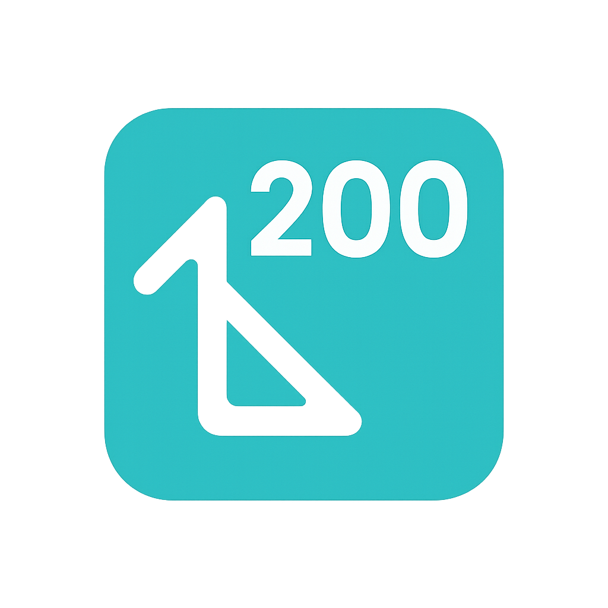
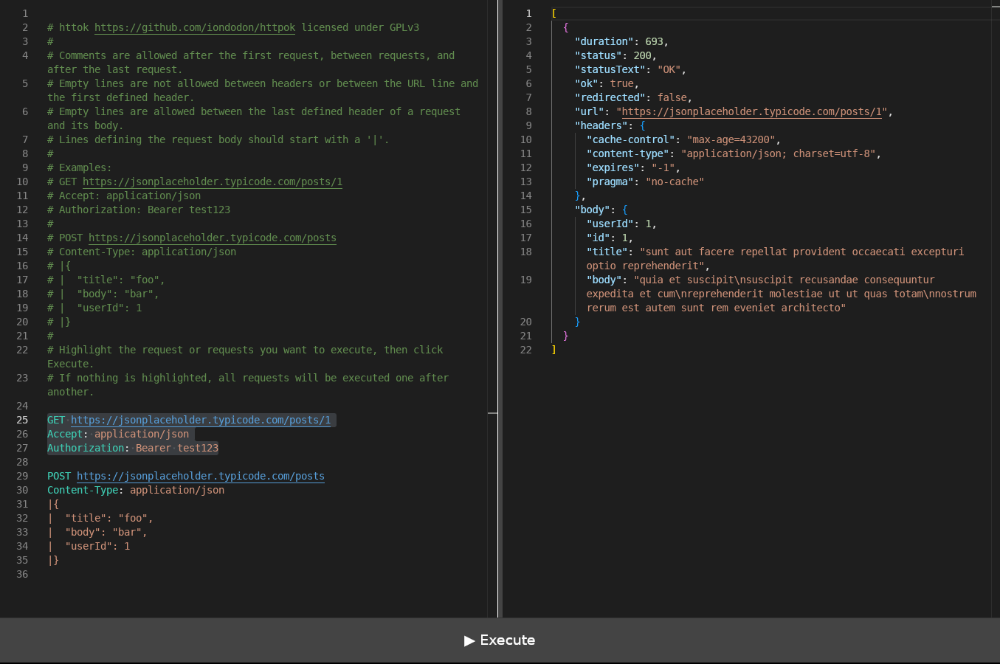

# httpok

<p align="center">
  
</p>

<p align="center">
  
</p>

**httpok** is a fast, minimalistic desktop HTTP client built with Tauri and SvelteKit. It lets you compose and test HTTP requests in a code editor interface, offering a lightweight alternative to tools like Postman or Insomnia.

---

## Features

- ✉️ **Write requests like code** – Use a simple, custom DSL to define HTTP requests directly in the built-in editor (powered by Monaco).
- ⏱ **Send and inspect** – Execute multiple requests at once, view response status, headers, and formatted body.
- 🔄 **Multi-request support** – Compose and run multiple HTTP requests from a single input.
- 📊 **JSON highlighting** – Pretty-print responses with syntax highlighting for JSON.
- 📥 **Built with Tauri** – Lightweight cross-platform app with native performance and secure architecture.

---

## Example Request

```
GET https://jsonplaceholder.typicode.com/posts/1
Accept: application/json
Authorization: Bearer token123
```

---

## Technologies

- [Tauri](https://tauri.app/) – Native desktop wrapper (Rust)
- [SvelteKit](https://kit.svelte.dev/) – Frontend framework
- [Monaco Editor](https://microsoft.github.io/monaco-editor/) – Code editor component
- [Chevrotain](https://chevrotain.io/) – HTTP request DSL parser
- TypeScript
- Vite

---

## Getting Started

### Prerequisites

- Node.js
- Rust
- Tauri CLI

### Install & Run

```bash
git clone https://github.com/iondodon/httpok
cd httpok
npm install
npm run tauri dev
```

### Build

```bash
npm run tauri build
```

---

## Project Structure

```
httpok/
├── src-tauri/           # Tauri backend (Rust)
├── src/                 # SvelteKit frontend
│   ├── routes/+page.svelte   # Main UI
│   └── lib/             # HTTP DSL parser and executor
├── static/              # Static assets
├── vite.config.ts       # Vite setup
├── svelte.config.js     # Svelte config
└── package.json
```

---

## License

httpok is licensed under [GPLv3](https://github.com/iondodon/httpok/blob/main/LICENSE.txt) @ Ion Dodon 2025.
